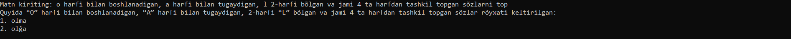

# UzWordCriteriaMatcher

## Overview

**UzWordCriteriaMatcher** is a Python tool designed to list Uzbek words that meet specific criteria. It extracts criteria from the input text and searches for words in its dataset of over 40,000 Uzbek words, returning a list of words that match the specified conditions.

The dataset of Uzbek words used in this project was obtained from [Uzbek Wiktionary](https://uz.wiktionary.org/wiki/Turkum:O%CA%BBzbek_tili).

## Features

- Extracts criteria from input text.
- Matches criteria against a dataset of Uzbek words.
- Returns a list of words that meet the specified criteria.

## Getting Started

To get started with **UzWordCriteriaMatcher**, follow these steps:

1. Clone the repository to your local machine.

   ```shell
   git clone https://github.com/abdulmalikkambarov/UzWordCriteriaMatcher.git

2. Navigate to the project directory.

   ```shell
   cd UzWordCriteriaMatcher

3. Install the required dependencies. Ensure you have Python installed.

   ```shell
   pip install fuzzywuzzy

4. Run the main script to use the tool.

   ```shell
   python inference.py

## Usage

When you run the inference.py, you will be prompted to enter your text. After entering your prompt (for example, "o harfi bilan boshlanadigan, a harfi bilan tugaydigan, l 2-harfi bõlgan va jami 4 ta harfdan tashkil topgan sõzlarni top"), the script will process the input and provide you with a message like this:


